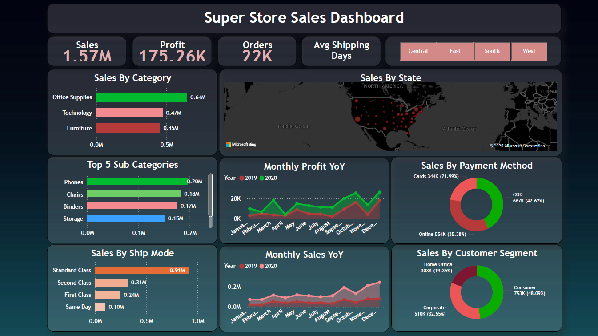
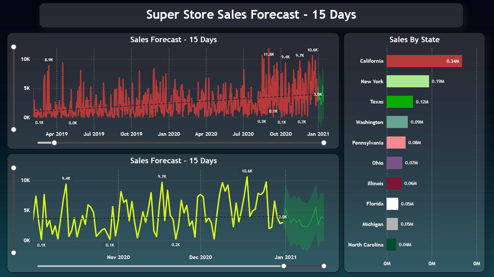

# My-SuperStore-Dashboard
Transform raw sales data into actionable insights!
A comprehensive sales analytics dashboard providing insights into revenue, profitability, and customer behavior patterns.

## Dashboard Overview
### Basic Dashboard

### Forecasting Dashboard

## Key Performance Indicators
- **Sales**: Total revenue generated
- **Profit**: Net earnings after costs
- **Quantity**: Total units sold
- **Avg Shipping Days**: Average delivery time

## Data Visualizations

### Comparative Analysis Charts
- **Sales by Category**: Revenue breakdown across product categories (Clustered Bar)
- **Top 5 Sub-Categories**: Highest revenue-generating products (Clustered Bar)
- **Sales by Ship Mode**: Revenue comparison by shipping method (Clustered Bar)

### Time-Series Analysis
- **Monthly Sales YoY**: 2019 vs. 2020 revenue comparison (Area Chart)
- **Monthly Profit YoY**: Year-over-year profit trends (Area Chart)

### Geographic & Segment Views
- **Sales by State**: Regional performance map (Bubble size represents sales volume)
- **Customer Segments**: Revenue contribution by segment (Donut Chart)
- **Payment Methods**: Transaction value by payment type (Donut Chart)

## Data Preparation
1. Removed empty columns ('ind1', 'ind2')
2. Standardized Returns column:
   - '#N/A' → '0' (Not returned)
   - '1' → (Returned)
3. Added calculated columns:
   - `AvgDelivery`: Days between order and shipment
   - `SalesForecast`: Daily sales aggregation for trend analysis

## Interactive Features
- **Region Filter**: Analyze data by US regions (Central, East, South, West)
- **15-Day Sales Forecast**: Time-series prediction with 95% confidence interval

## Business Insights
1. **October Performance**: Lower sales but higher profits (potential margin increases)
2. **Shipping Preferences**: 62% choose Standard Class (cost sensitivity)
3. **Payment Trends**:
   - 49% Cash on Delivery (trust factor)
   - 22% Credit Cards (opportunity for incentives)

## Technical Implementation
- **Tools**: Power BI (Visualization), DAX (Calculations)
- **Data Source**: SuperStore Sales Dataset (CSV/Excel)

---

